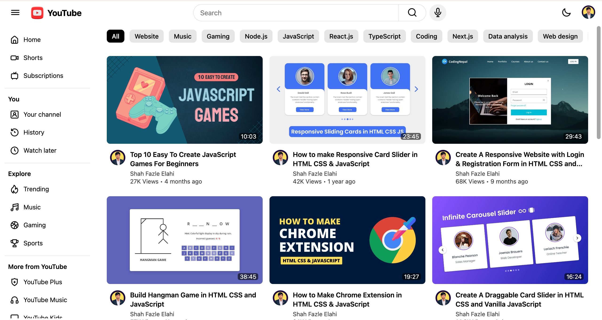

# YouTube - Shah Fazle Elahi

This is a clone of the YouTube user interface, designed to mimic the look and feel of the popular video platform. Built using **HTML**, **CSS**, and **JavaScript**, the project focuses on responsive design and modern web practices. The goal of this project is to create a lightweight yet visually appealing clone that replicates core UI features while providing a strong foundation for further development.

## Features
- **Responsive Design:** The layout adjusts automatically to different screen sizes and devices, ensuring a seamless user experience on both mobile and desktop.
- **Sidebar Navigation:** A fully functional sidebar with various sections like Home, Shorts, Subscriptions, and Explore.
- **Search Bar:** A central search bar allowing users to mimic searching for videos.
- **Dark Mode:** Users can toggle between light and dark themes using the moon/sun icon. The user's preference is stored in `localStorage` to persist between sessions.
- **Video Grid Layout:** A grid of video cards with thumbnails, titles, channel names, and view counts, similar to YouTube’s layout.

## Technologies Used
- **HTML5:** Structuring the web page and content.
- **CSS3:** Styling the project with animations, responsiveness, and dark mode compatibility.
- **JavaScript:** Adding interactivity such as sidebar toggling, dark mode switching, and localStorage management.

## Future Implementations
Here are some features and improvements planned for future updates:
- **Video Playback:** Add the ability to play embedded videos directly within the app.
- **User Authentication:** Implement user login and signup features, allowing users to have personalized accounts.
- **Subscriptions and Notifications:** Enable users to subscribe to channels and receive notifications.
- **Dynamic Video Content:** Load video data dynamically from a backend or API to make the video grid more functional and connected to a database.
- **Comments Section:** Implement a comment section for each video where users can post and view comments.
- **Advanced Search:** Add a more sophisticated search functionality, complete with filters for video duration, channel, and more.
- **History and Watch Later:** Include features for tracking watch history and saving videos for later viewing.
